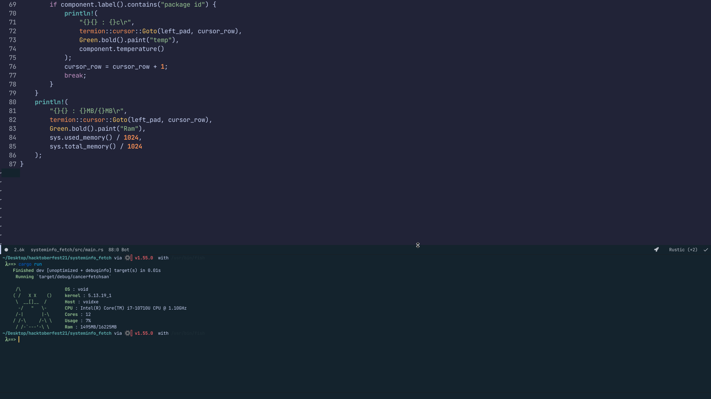

# Screenfetch CLI  

### Sys Fetch program in rust and fun ofc ,needs rustc 1.54 or above for sysinfo
## To build the executable: 🛠️
```bash
cargo build --release && cd target 
```
## To run: 🏃
```bash
./cancerfetchsan
```

## HoW iT LookS: 👀  



